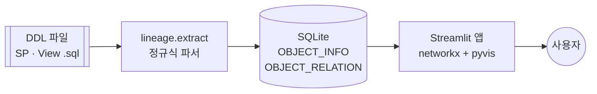

# SQL Lineage Explorer

DW 의 Stored Procedure·View DDL 을 파싱해 **테이블 간 데이터 흐름(lineage)** 을 추출하고,
웹 화면에서 객체별 상위(원천)·하위(영향) 계보를 탐색하는 도구입니다.
상용 lineage 솔루션 없이, DDL 스크립트만으로 영향도 분석과 장애 원인 추적을 할 수 있게 만드는 것이 목표입니다.



## 빠른 시작

```bash
pip install -r requirements.txt

python -m lineage.extract --ddl-dir ddl --db data_lineage.db   # 샘플 DDL → 메타 DB
streamlit run app.py                                           # http://localhost:8501
```

`ddl/` 에는 가상의 리테일 DW(ERP·POS → 스테이징 → DW → 마트) 샘플이 들어 있습니다.
실제 환경에서는 SSMS 의 **스크립트 생성**(개체당 파일 하나)으로 내보낸 폴더를 `--ddl-dir` 로 지정하면 됩니다.

| 옵션 | 설명 |
|---|---|
| `--ddl-dir` | `.sql` 파일을 하위 폴더까지 탐색 (기본 `ddl`) |
| `--db` | 메타 DB 경로 (기본 `data_lineage.db`). 앱은 환경변수 `LINEAGE_DB` 로 같은 파일을 읽음 |
| `--default-schema` | 스키마 없이 쓴 객체에 붙일 스키마. `dbo` 로 주면 `Orders` 와 `dbo.Orders` 를 같은 객체로 봄 (기본 `''`) |
| `-v` | 파일별로 추출된 관계를 모두 출력 |

추출은 실행할 때마다 현재 DDL 기준으로 관계를 다시 만들기 때문에, 삭제되거나 바뀐 DDL 의 옛 관계가 남지 않습니다.

## 화면

- **객체 선택**: 입력해서 검색, 방향(전체 / 상위 / 하위) 선택
- **그래프**: 왼쪽→오른쪽 계층 배치. 선택 객체는 빨강, 상위는 파랑, 하위는 초록이며 테이블은 네모, 뷰는 타원입니다. 노드에 마우스를 올리면 그 객체를 만드는 프로시저·뷰가 보입니다.
- **계보 목록**: 상위·하위를 1차, 2차, … 단계별로 나열하고, 각 객체를 적재하는 프로시저·뷰를 함께 표시합니다.

프로시저 이름은 SSMS 파일명 규칙(`<schema>.<object>.<Type>.sql`)에서 읽어 `usp_load_fact_sales - SP` 처럼 표시하고,
규칙에 맞지 않는 파일은 파일 이름을 그대로 씁니다.

## 추출 방식

정규식 기반이며, 정확도를 위해 네 단계로 처리합니다.

1. **전처리**: 주석과 문자열 리터럴을 한 번에 제거합니다. 문자열 안의 `FROM x` 나 주석 안의 SQL 이 관계로 잡히지 않고, 동적 SQL(`EXEC('...')`)도 자연히 제외됩니다. 이어서 `GO` 로 배치를 나눕니다.
2. **구문(statement) 분리**: 괄호와 `CASE ... END` 깊이를 추적하며 최상위 키워드에서 자릅니다. 그래서 **한 프로시저 안의 서로 다른 INSERT 문끼리는 연결하지 않습니다.**
   `INSERT ... SELECT`, `UPDATE ... SET ... FROM`, `WITH cte AS (...) <DML>`, `CREATE VIEW ... AS SELECT`, `UNION ALL`, `MERGE ... ;` 는 한 구문으로 유지합니다.
3. **구문 분석**: 대상과 원천을 찾습니다.
   - 대상: `INSERT [INTO]`, `UPDATE`, `DELETE [FROM]`, `MERGE [INTO]`, `SELECT ... INTO`, `CREATE [OR ALTER] VIEW`, `ALTER VIEW`
   - 원천: `FROM`, `JOIN`, `USING`, 콤마 조인(`FROM a, b`)
   - 걸러내는 것: CTE 이름, 테이블 반환 함수, 테이블 힌트(`WITH (NOLOCK)`), 자기 자신 참조
   - `UPDATE f SET ... FROM dw.fact f` 처럼 **별칭으로 쓴 대상은 실제 테이블로** 바꿉니다.
4. **임시 객체 연결**: `#temp`, `@table` 변수를 거치는 흐름은 원래 원천에서 최종 대상으로 이어 붙입니다.
   예: `erp.orders → #t → dw.fact` 는 `erp.orders → dw.fact` 로 저장됩니다.

이름은 `[db].[schema].[object]`, `db..object` 형태를 모두 `schema.object` 로 정규화하고, 대소문자는 구분하지 않습니다.
파일 인코딩은 UTF-16(SSMS 기본), UTF-8(BOM 유무), CP949(한글 주석) 를 자동 판별합니다.

### 한계

- 테이블 단위 lineage 입니다 (컬럼 단위 아님).
- 동적 SQL, 시노님, 다른 프로시저 호출(`EXEC dbo.other_proc`) 내부는 따라가지 않습니다.
- `UPDATE ... FROM` / `DELETE ... JOIN` 의 조인 테이블은 필터로만 쓰여도 원천으로 기록합니다 (영향도 분석에서는 의존 관계로 보는 것이 안전하기 때문).

## 메타 DB 스키마 ([`schema.sql`](schema.sql))

| 테이블 | 주요 컬럼 | 비고 |
|---|---|---|
| `OBJECT_INFO` | `OBJECT_NAME`, `OBJECT_TYPE`(TABLE/VIEW), `SCHEMA_NAME` | UNIQUE(이름, 유형, 스키마). 스키마 기본값 `''`, 대소문자 무시 비교 |
| `OBJECT_RELATION` | `SOURCE_OBJECT_ID`, `TARGET_OBJECT_ID`, `RELATION_TYPE`, `FILE_PATH` | UNIQUE(원천, 대상, 유형, 파일). 같은 관계를 여러 프로시저가 만들면 모두 기록 |

- 두 테이블 모두 `CREATED_DATE` 기본값은 `CURRENT_TIMESTAMP` 입니다.
- 연결할 때마다 `PRAGMA foreign_keys = ON` 을 실행해 외래키를 검사합니다.
- 원천으로 먼저 등록된 객체가 나중에 뷰로 정의되면 유형을 `VIEW` 로 바꿉니다.

SQL 로 직접 조회할 수도 있습니다.

```sql
-- dw.fact_sales 를 만드는 원천과 프로시저
SELECT s.SCHEMA_NAME || '.' || s.OBJECT_NAME AS source, r.FILE_PATH
FROM OBJECT_RELATION r
JOIN OBJECT_INFO s ON s.OBJECT_ID = r.SOURCE_OBJECT_ID
JOIN OBJECT_INFO t ON t.OBJECT_ID = r.TARGET_OBJECT_ID
WHERE t.SCHEMA_NAME = 'dw' AND t.OBJECT_NAME = 'fact_sales';
```

## 구조

```
lineage/sql_parser.py   전처리 · 구문 분리 · 대상/원천 추출 · 임시 객체 연결
lineage/extract.py      CLI: DDL 디렉터리 스캔, 인코딩 판별, 메타 DB 동기화
lineage/db.py           SQLite 스키마 생성, 객체/관계 저장, 조회
lineage/graph.py        networkx 그래프, 상위/하위 단계 탐색, 프로시저 라벨
app.py                  Streamlit 화면 (pyvis 그래프 + 계보 목록)
schema.sql              메타 DB DDL
ddl/                    샘플 DDL (UTF-16 · UTF-8 · CP949 혼합)
tests/                  파서 · DB · 그래프 · 화면 테스트
```

## 테스트

```bash
pip install -r requirements-dev.txt
pytest
```

파서 단위 테스트(구문 분리, 별칭, CTE, 임시 객체, MERGE, 인코딩 등), 메타 DB 제약(외래키, 기본값, 중복 방지, 재실행),
그래프 탐색, 그리고 Streamlit `AppTest` 로 실제 화면 스크립트를 실행해 객체 선택과 방향 전환까지 검증합니다.

## License

MIT
